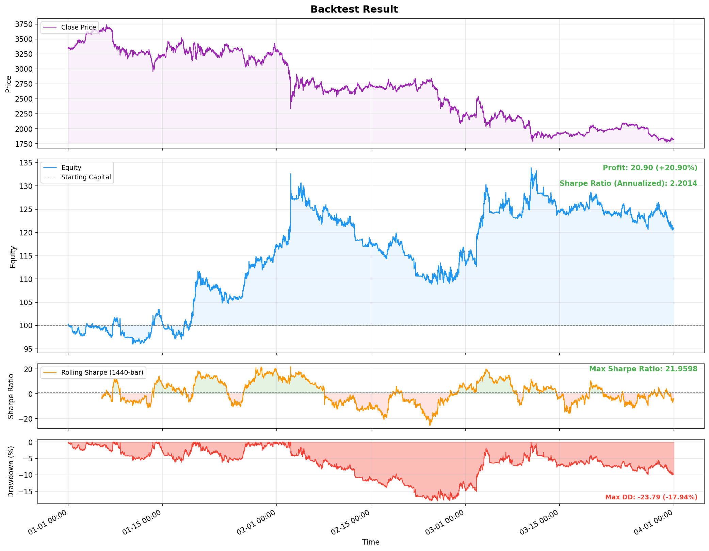

# Trading

Algorithmic trading framework for backtesting and live futures executor on crypto exchanges.



## Project Structure

```
trading/
├── setup.py                # Configuration: credentials, pair, timeframe, strategy
├── setup_example.py        # Example config with placeholder credentials
├── backtest.py             # Run a historical backtest
├── trade.py                # Run live trading via OKX
├── signal/
│   └── macross.py          # EMA crossover signal generator
├── strategy/
│   └── drawdown.py         # Drawdown-aware position sizing with multi-signal selection
├── executor/
│   ├── backtester.py       # Backtester engine (batch evaluation + streaming API)
│   └── future.py           # Live futures executor (OKX order management)
├── source/
│   ├── binance.py          # Binance data downloader (OHLCV + order book)
│   └── okx.py              # OKX REST + WebSocket client
└── dataloader/
    ├── ohlc.py             # Load OHLCV CSVs into DataFrames
    └── order_book.py       # Load order book CSVs into DataFrames
```

## How It Works

### Signals

Signals generate raw trade directions from price data. Each signal implements `generate_signals(df)` and returns a DataFrame with a `position` column (+1 long, -1 short, 0 flat).

- **MACross** — EMA crossover. Emits a signal only at crossover points where the short EMA crosses above (long) or below (short) the long EMA. Position is held between crossovers.

### Strategy

Strategies wrap signals with risk management and signal selection logic.

- **DrawdownPositionSize** — Accepts multiple signals, evaluates each one's rolling Sharpe ratio, and picks the best performer. Position size is scaled down as portfolio drawdown deepens according to configurable thresholds. When drawdown exceeds a re-evaluation threshold, the signal choice is reconsidered.

### Executor

Two executor modes share the same streaming interface (`ack`):

- **Backtester** — Feeds historical candles through the strategy pipeline and produces equity curves, drawdown charts, and Sharpe ratio metrics.
- **Future** — Connects to OKX for live futures trading. Manages leverage, position tracking, and order execution with retry logic.

### Data Sources

- **Binance** — Downloads historical OHLCV candles and order book snapshots via the public REST API.
- **OKX** — REST client for account, market data, and trading endpoints. WebSocket client for real-time candle streaming.

## Setup

1. Copy the example config and fill in your OKX credentials:

```bash
cp setup_example.py setup.py
```

2. Edit `setup.py` and replace the placeholder values:

```python
okx_api_key = "your-api-key"
okx_secret_key = "your-secret-key"
okx_passphrase = "your-passphrase"
okx_demo = True              # Set to False for live trading
```

> **Note:** `setup.py` contains secrets and should not be committed. Only `setup_example.py` is safe to share.

## Configuration

All trading parameters are defined in `setup.py`:

```python
pair = "ETH/USDT"           # Trading pair (used for Binance data download)
instrument = "ETH-USDT-SWAP" # OKX instrument ID (used for live trading)
step = "1m"                  # Candle interval
cap = 100                    # Starting capital (USDT)
leverage = "10"              # Futures leverage

start = "2025-01-01T00:00:00Z"  # Backtest start
end = "2025-02-01T00:00:00Z"    # Backtest end
preload_duration = "6h"         # Candle history to preload for live trading

strategy = DrawdownPositionSize(
    signals=[
        MACross(short=15, long=17),
        MACross(short=10, long=17),
        MACross(short=5, long=17),
    ],
    size={
        0: 0.5,        # No drawdown    → 50% position size
        0.04: 0.04,    # 4% drawdown    → 4% position size
        0.06: 0.02,    # 6% drawdown    → 2% position size
    },
    reevaluate_threshold=0.1,  # At 10% drawdown, re-evaluate signal choice
    window=500,                # Rolling equity peak lookback
    sharpe_window=1440,        # Rolling Sharpe ratio lookback
)
```

## Usage

### Backtest

```bash
python backtest.py
```

Downloads historical data from Binance (if not cached), runs the strategy, prints performance metrics, and saves an equity/drawdown chart to `backtest.png`.

### Live Trading

```bash
python trade.py
```

Connects to OKX (demo mode by default), preloads recent candles, subscribes to real-time candle updates, and executes futures trades based on strategy signals.

## Dependencies

- pandas
- numpy
- matplotlib
- requests
- websockets
